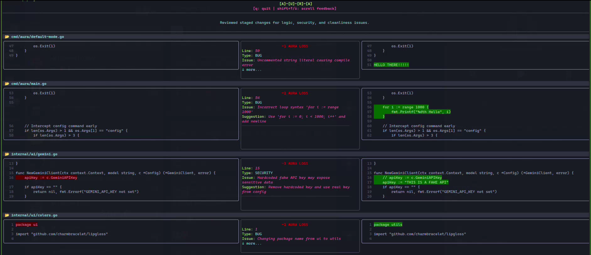
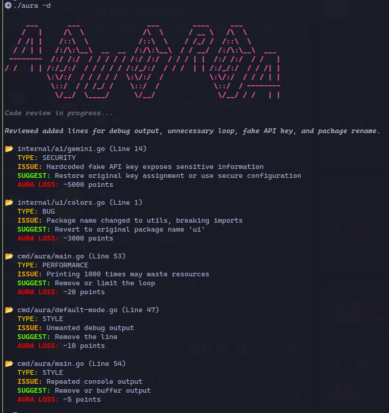

## Make Your Code Shine, No Aura Lost

Let's be honest: there is no greater **Aura Loss** than having a Senior Dev comment *"this won't even compile"* or *"why is there a nested loop inside a nested loop?"* on your PR.

Aura acts as a tactical buffer between your "creative" 3:00 AM coding sessions and the cold, judgmental eyes of your peers. 

**Use `Aura` to avoid:**
* The "I'll fix this later" comment you forgot to delete.
* Sending a PR that breaks the build in 4 different ways.
* Implementation so complex that even the AI gets a headache.
* Total loss of street cred during the Friday afternoon code review.

`AURA` is still under active development. More cool features coming soon!

**Review with Aura. Refine your code. Keep your dignity :)**

---

## ✨ Features

* **Aura Scoring** – Quantifiable feedback on code quality via the "Aura Loss" metric. High-impact issues are prioritized and sorted automatically.
* **Dual-Engine Review** – Utilizes JSON Structured Output for precision, with a robust fallback parser for unstructured LLM responses.
* **Side-by-Side Diffing** – Crystal clear terminal view of your staged changes with integrated AI commentary.
* **Zero-Latency Feel** – Built with Go and Bubble Tea for a snappy, responsive TUI experience.

---

## 🚀 Quick Start

### 1. Installation
Ensure you have Go 1.21+ installed.
```bash
git clone [https://github.com/Mercury1565/Aura.git](https://github.com/Mercury1565/Aura.git)
cd Aura
go build -o aura ./cmd/aura
```

### 2. Configuration

Aura stores your settings in `~/.config/aura/config.yaml`. You can set them directly from the CLI without opening an editor. Here is a working example using the working setup with the [Groq API provider](https://groq.com/):

#### Set your API Key
```bash
./aura config groq_api_key "your_groq_api_key_here"
```

#### Set your preferred model
```bash
./aura config model_name "llama-3.3-70b-versatile"
```

### 3. Usage

Review your currently staged changes:

```bash
# Launch the full interactive TUI
./aura
```



```bash
# Prints a prioritized summary to console and exits (one of the two below)
./aura -d
./aura --dry
```


```bash
# Check where your config is stored (one of the two below)
./aura -w
./aura --where
```

```bash
# See the model name (one of the two below)
./aura -m
./aura --model
```

```bash
# Get help (one of the two below)
./aura -h
./aura --help
```

---

## ⌨️ Keybindings

| Key | Action |
| --- | --- |
| `q` / `ctrl+c` | Exit Aura |
| `↑` / `↓` | Scroll through the code diff |
| `shift+↑/↓` | Internal scroll for AI feedback columns |

---

## 🛠️ Architecture

Aura leverages the **Charmbracelet** ecosystem to provide a modern TUI:

* **[Bubble Tea](https://github.com/charmbracelet/bubbletea)** – For the functional state machine (The Elm Architecture).
* **[Lipgloss](https://github.com/charmbracelet/lipgloss)** – For the "High-Aura" styling and shimmering color-cycle animations.
* **[Go-GitDiff](https://github.com/bluekeyes/go-gitdiff)** – For low-level parsing of patch files.
* **Structured AI** – Enforces a strict JSON schema for AI responses to ensure data integrity.

---

## 🎨 The Philosophy

> "Code is not just logic; it is a signature. Bad patterns don't just cause bugs; they cause Aura Loss."

Aura was built to catch complexity before it becomes technical debt, all while staying inside the flow of the terminal. It evaluates code across five dimensions:

1. **BUG** - Functional errors.
2. **SECURITY** - Vulnerabilities.
3. **STYLE** - Maintainability and "vibe."
4. **PERFORMANCE** - Efficiency and resource usage.
5. **COMPLEXITY** - Cognitive load and abstraction health.
